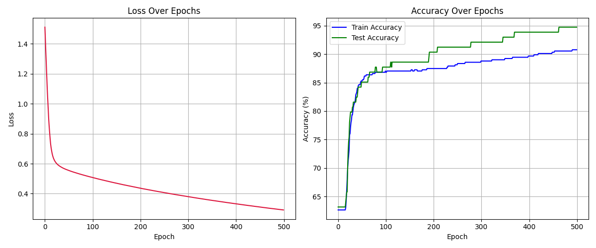

# 🔬 Breast Cancer Neural Network — From Scratch, With NumPy

> Predicting malignant vs. benign tumors using nothing but NumPy and raw math.  
> No PyTorch. No TensorFlow. Just gradients, matrices, and way too many `print()`s.

---

## 🧠 Project Overview

This project implements a **Neural Network from scratch**, built entirely with **Python + NumPy**, to classify breast cancer tumors from the **Wisconsin Breast Cancer Dataset**.

- 🔍 **Binary Classification** (Malignant = 1, Benign = 0)
- 🧾 **Dataset**: 569 samples, 30 features per sample
- 💡 **Architecture**: `Input(30) → Hidden(8, ReLU) → Output(1, Sigmoid)`

---

## 🛠️ Features

- 🧮 Manual implementation of:
  - Forward pass
  - Backpropagation
  - Gradient descent
- 📉 Binary Cross-Entropy loss (with numerical stability)
- ⚙️ He/Xavier initialization
- 📊 Mini-batch training (batch size = 32)
- 📈 Accuracy & loss tracking with custom matplotlib plots
- 🧼 Feature normalization via StandardScaler

---

## 📦 File Structure

```bash
.
├── train.py         # Training loop, data handling
├── NN.py      # NeuralNetwork class (manual forward + backprop)
├── neuron.py       # ReLU, Sigmoid, and linear layers
├── get_data.py        # data fetching, splitting and more ;)         
└── README.md       # You're here!

```
---
### ✅ Results

- **Test Accuracy**: **91.4%**

- **Confusion Matrix**:

  |                | **Predicted Malignant** | **Predicted Benign** |
  |----------------|-------------------------|-----------------------|
  | **Actual Malignant** | 38 (True Negative)        | 4 (False Positive)     |
  | **Actual Benign**    | 2 (False Negative)        | 70 (True Positive)     |


- **Training Accuracy & Loss Over Time**:

  

---

# Made with Numpy, grit and love for learning